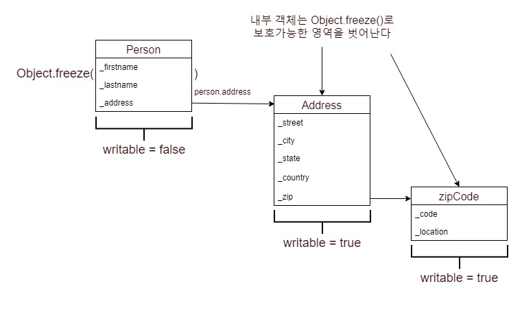

# 고계 자바스크립트

* 앞서 1장에서 함수형 패러다임의 장점을 설명했다
* 하지만 패러다임은 그저 프로그래밍 모델일 뿐 올바른 언어로 살려내야만 의미가 있다
* 2장은 객체지향과 함수형을 혼합한 하이브리드 언어인 자바스크립트를 살펴본다
* 이 책의 주제는 함수형이기에 자바스크립트가 함수형 언어로 손색이 없음과 동시에 아쉬운점을 중점적으로 볼 것이다
* 특히 자바스크립트에서 함수형을 사용할 수 있게 만드는 주역인 고계함수와 클로저에 비중을 두고 설명할 것이다

## 2.1 왜 자바스크립트인가?
* 자바스크립트는 어떤 언어보다도 폭넓게 사용되는 FP 언어다
* 구문은 C와 비슷하지만 Lisp, Scheme 같은 함수형 언어의 영향을 많이 받았다
* Lisp과 Scheme의 고계함수, 클로저, 배열 리터럴 등은 자바스크립트가 FP 언어가 되는데 초석이 되었다
* 사실 함수는 자바스크립트의 주요 작업 단위로서 애플리케이션에 할 일을 시키는 동시에 객체 정의, 모듈 생성, 이벤트 처리 등의 책임도 맡는다
* 자바스크립트는 계속 진화하면서 이터레이터, 프라미스, 화살표 함수, 상수 등 FP에 걸맞는 기능이 점점 추가되고 있다

## 2.2 함수형 대 객체지향 프로그래밍
학습 관리 시스템의 Student 객체
  * Student 클래스는 형식 계층 관점에서 성, 이름, 주소 등을 포함한 Person의 하위형이다
  * 여기에 추가할 기능이 있으면 CollegeStudent 같은 형식을 만들어 붙이면 된다 
  * 문제는 모든 하위형에 적용할 필요 없는 기능을 기존 객체에 추가하는 것이다
  * 가령 firstname, lastname은 Person과 그 하위형들 모두에서 의미가 있다
  * 그러나 workAddress는 Student보다 Employee 같은 객체를 위한 것이다
  * 객체지향과 함수형의 가장 중요한 차이는 이런 데이터(객체 속성)와 기능(함수)을 조직하는 방법에 있다

객체지향 프로그래밍
  * 명령형 코드로 이루어진 객체지향 애플리케이션은 인스턴스 메서드로 가변 상태를 노출하고 조작한다
  * 이를 위해 객체 기반의 캡슐화에 의존한 채 가변 상태의 무결성을 유지한다
  * 결국 객체의 데이터와 잘게 나뉜 기능이 단단히 유착되어 응집도가 높은 패키지를 형성한다
  * 이는 객체지향이 추구하는 목적이자 모든 추상화의 주요 형태가 객체인 이유다 

함수형 프로그래밍
  * 호출자로부터 데이터를 숨길 필요 없이 아주 단순한 소규모의 자료형을 대상으로 움직인다
  * 함수형은 데이터와 기능을 느슨하게 결합한다
  * 함수형은 잘게 나뉜 인스턴스 메서드 대신 여러 자료형에 두루 적용 가능하고 굵게 나뉜 연산에 의존한다
  * 함수는 함수형 패러다임의 주된 추상화 형태다

두 패러다임은 적절히 섞어서 사용할 수 있다
  * 이를 위해서는 객체를 불변 개체entity나 불변 값으로 바라보고 기능을 함수로 분리해 객체 내에서 작동시켜야 한다
  ~~~
  get fullname() {
      return [this._firstname, this._lastname].join(' ');
  }

  위 코드는 아래처럼 나눌 수 있다

  var fullname = person => [person.firstname, person.lastname].join(' ');
  ~~~   
  * JS는 동적 언어기 때문에, 일반화한 다형성 함수를 지원한다
  * 즉, 기반형인 Person을 가리키는 레퍼런스를 사용하는 함수라면 파생형(Student, ...)에서도 문제없이 작동한다
  * OOP는 메서드에 상속 계층을 두고 데이터를 서로 단단히 바인딩하는 일에 집중한다
  * 이와 달리 함수형은 다양한 자료형을 아우르는 일반적인 다형성 함수를 선호하며 this를 가급적 사용하지 않는다

파생형을 여러개 만들지 않고 함수의 기능을 확장하는 법
* OOP와 FP를 비교하면서 확장법을 살펴보자

객체지향으로 개발하기
```js
class Person {
  constructor(firstname, lastname, ssn) {
    this._firstname =firstname ;
    this._lastname = lastname;
    this._ssn = ssn;
    this._address = null;
    this._birthYear = null;
  }
  get ssn() {
    return this._ssn;
  }
  get firstname() {
    return this._firstname;
  }
  set firstname(firstname) {
		this._firstname = firstname;
		return this;
	}
  get lastname() {
    return this._lastname;
  }
  get address() {
    return this._address;
  }
  get birthYear() {
    return this._birthYear;
  }
  set birthYear(year) {
    this._birthYear = year;
  }
  set address(addr) {
    this._address = addr;
  }
  toString() {
    return `Person(${this._firstname}, ${this._lastname})`;
  }
}

class Student extends Person {
  constructor(firstname, lastname, ssn, school) {
    super(firstname, lastname, ssn);
    this._school = school;
  }
  get school() {
    return this._school;
  }
}

class Address {
	/**
	 * Construct a new address object
	 * @param country Country code (required)
	 * @param state State code 
	 * @param city City name
	 * @param zip Zip code value object instance  
	 * @param street Street name
	 *
	 */
	constructor(country, state = null, city = null, zip = null, street = null) {
		this._country = country;
		this._state = state;
		this._city = city;
		this._zip = zip;
		this._street = street;
	}
	
	get street() {
		return this._street;
	}

	get city() {
		return this._city;
	}

	get state() {
		return this._state;
	}
	
	get zip() {
		return this._zip;
	}
	
	get country() {
		return this._country;
	}

	set country(country) {
		this._country = country;
		return this;
	}
};
```
* 함수를 다른 함수의 인자로 전달하여 함수의 기능을 확장하는 방법이 있다
* 어떤 사람(Person)과 거주 국가가 같은 사람을 전부 찾고
* 어떤 학생(Student)과 거주 국가와 다니는 학교가 모두 같은 학생을 찾는 코드를 개발해야 한다고 가정하자

```js
// Person 클래스에 추가
peopleInSameCountry(friends) {
  var result = [];
  for (let idx in friends) {
    var friend = friends[idx];
    if (this.address.country === friend.address.country) {
      result.push(friend);
    }
  }
  return result;
};

// Student 클래스에 추가
studentInSameCountryAndSchool(friends) {
  var closedFriends = super.peopleInSameCountry(friends);
  var result = [];
  for (let idx in closedFriends) {
    var friend = closedFriends[idx];
    if (friend.school === this.school) {
      result.push(friend);
    }
  }
  return result;
};

var curry = new Student('Haskell', 'Curry', '111-11-1111', 'Penn State');
curry.address = new Address('US');

var turing = new Student('Alan', 'Turing', '222-22-2222', 'Princeton');
turing.address = new Address('England');

var church = new Student('Alonzo', 'Church', '333-33-3333', 'Princeton');
church.address = new Address('US');

var kleene = new Student('Stephen', 'Kleene', '444-44-4444', 'Princeton');
kleene.address = new Address('US');

church.studentInSameCountryAndSchool([curry, turing, kleene]);
// console.log에 넘겨서 실행해보면 Kleene가 나온다
```
* this와 super로 한 객체와 그 부모가 객체가 단단히 결합된 코드가 된다

함수형으로 개발하기
```js
var selector = (country, school) =>
  (student) =>
    student.address.country === country &&
    student.school === school;

var findStudentBy = (friends, selector) =>
  friends.filter(selector);

findStudentBy([curry, turing, church, kleene],
  selector('US', 'Princeton')
); // [church, kleene]
```
* 해결해야 하는 문제를 작은 함수들로 잘게 나눈다
* 객체지향이 데이터와 데이터 사이의 관계의 본질에 초점을 둔다면, 함수형의 관심사는 기능(해야할 일)에 초점을 둔다

#### 객치지향, 함수형의 주요 특징 비교
| 특징 | 함수형 | 객체지향 |
| ------ | ------ | ------- |
| 합성 단위 | 함수 | 객체(클래스) |
| 프로그래밍 스타일 | 선언적 | 명령형 |
| 데이터와 기능 | 독립적인 순수함수가 느슨하게 결합 | 클래스 안에서 메서드와 단단히 결합 |
| 상태 관리 | 객체를 불변 값으로 취급 | 인스턴스 메서드를 통해 객체를 변이시킴 |
| 제어 흐름 | 함수와 재귀 | 루프와 조건 분기 |
| 스레드 안전 | 동시성 프로그래밍 가능 | 캡슐화하기 어려움 |
| 캡슐화 | 모든 것이 불변이라 필요 없음 | 데이터 무결성을 지키기 위해 필요함 |

### 2.2.1 자바스크립트 객체의 상태 관리

상태(state)
* 어느 한 시점에 찍은 모든 객체에 저장된 데이터의 스냅샷
* js의 객체는 동적이어서 언제건 속성을 추가, 삭제, 수정할 수 있다
* 이런 특징은 객체 상태를 보호하기 어렵게 만든다
* 따라서 js를 함수형 언어로 사용할 때 상태관리는 아주 중차대한 문제가 된다
* 함수형js에서 데이터를 완전히 캡슐화해 보호하는 건 훈련을 통해 엄격히 지켜야할 목표다

### 2.2.2 객체를 값으로 취급

값(value)
* 문자열, 숫자 같은 원시 타입은 처음부터 불변값이므로 다루기 쉽다
* 앞서 1장에서 불변성을 바탕으로 사고하려면 사실상 모든 객체를 값처럼 취급해야 한다고 언급한 바 있다
* 그래야만 객체가 도중에 바뀔지 모른다는 불안감 없이 객체를 주고받는 함수를 구현할 수 있다
* ES6부터는 상수를 선언하기 위해 const 키워드가 추가되었다
* const로 선언된 변수는 값을 재할당하거나 레퍼런스를 다시 선언할 수 없다
* 그러나 const만으로는 FP가 요구하는 수준의 불변성을 실현하기 어렵다
* 값을 재할당하는 것은 막을 수 있지만, 객체의 내부 상태가 변하는 것까지는 막지 못하기 때문이다
  ```js
  const student = new Student('Alonzo', 'Church', '666-66-6666', 'Princeton');
  student.lastname = 'Mourning'; // 속성 값이 바뀐다
  ```
  * 위 코드처럼 객체 내부 상태는 변화시킬 수 있다
  * 따라서 value object 패턴 같은 보다 엄격한 불변성 정책이 필요하다

value object 패턴
* vo는 객체의 동등성equality이 항등성identity 또는 레퍼런스가 아닌 오직 값에 따라 좌우되는 객체를 말한다
* 일단 vo 객체를 선언한 이후의 상태는 절대 변하지 않는다
* 문자열, 숫자 외에도 tuple, pair, point, zipCode, coordinate, money, date 같은 형식이 모두 값 객체다
  ```js
  function zipCode(code, location) {
    let _code = code;
    let _location = location || '';

    return {
      code: function() {
        return _code;
      },
      location: function() {
        return _location;
      },
      fromString: function(str) {
        let parts = str.split('-');
        return zipCode(parts[0], parts[1]);
      },
      toString: function() {
        return _code + '-' + _location;
      }
    };
  }
  
  const princetonZip = zipCode('08544', '3345');
  princetonZip.toString(); // '08544-3345'
  ```
  * 메서드를 일부만 호출자에 공개하고, _code, _location을 의사-프라이빗pseudo-private 변수처럼 다루는 객체 리터럴 인터페이스object literal interface를 반환하는 식으로 함수를 이용하면 내부 상태 접근을 차단할 수 있다
  * 이 함수로 반환된 객체는 사실상 변이를 일으키는 메서드가 전혀 없는 기본형처럼 작동한다
  * vo는 함수형/객체지향 모두에서 가볍고 다루기 편하다

  ```js
  function coordinate(lat, long) {
    let _lat = lat;
    let _long = long;

    return {
      latitude: function () {
        return _lat;
      },
      longitude: function () {
        return _long;
      },
      translate: function (dx, dy) {
        return coordinate(_lat + dx, _long + dy);
      },
      toString: function () {
        return '(' + _lat + ',' + _long + ')';
      }
    };
  };

  const greenwich = coordinate(51.4778, 0.0015);
  greenwich.toString(); // '(51.4778, 0.0015)'
  greenwich.translate(10, 10).toString();  //'(61.4778,10.0015)'
  ```
  * translate처럼 사본을 새로 만들어 반환하는 메서드는 불변성을 구현하는 또 다른 수단이 된다
  * 이를 이용하면 새 coordinate 객체가 만들어져 반환된다
  * vo는 이상적인 패턴이긴 하지만 실세계의 문제를 전부 해결하기엔 충분하지 않다
  * 레거시 객체나 Person, Student 같은 계층적 데이터를 처리하려면 Object.freeze를 사용해야 한다

### 2.2.3 가동부를 깊이 동결

숨겨진 메타속성(metaproperty)
* 자바스크립트 클래스 구문에 불변 필드를 표시하는 키워드는 따로 없다
* 그러나 Object.freeze로 writable라는 숨겨진 메타속성을 false로 변경하면 불변 필드로 사용이 가능하다
  ```js
  const person = Object.freeze(new Person('Haskell', 'Curry', '444-44-4444'));
  person.firstname = 'Bob';
  // Uncaught TypeError: Cannot assign to read only property '_firstname' of object
  ```
  * person의 속성은 모두 읽기 전용read-only 상태로 바뀌어 변경을 시도하면 에러가 발생한다
  * Object.freeze는 상속한 속성까지 고정하므로 Student 인스턴스를 동결하면 이 객체의 프로토타입 체인을 따라가 Person이 물려준 속성 역시 모두 같은 방법으로 동결시킨다
  * 단, 중첩된 객체 속성까지 동결하는 건 불가능하다
### 
  * 이렇게 최상위 객체만 동결되는 것을 얕은 동결(shallow freeze)이라고 한다

```js
var person = new Person('Haskell', 'Curry', '444-44-4444');
person.address = new Address(
  'US', 'NJ', 'Princeton',
  zipCode('08544', '1234'), 'Alexander St.');

person = Object.freeze(person);
person.address._country = 'France'; // 허용
person.address.country; // France
```
* 내부 속성은 동결되지 않으므로 위 코드는 아무 에러도 나지 않는다
* 내부 속성까지 확실히 동결하고 싶다면 다음 코드처럼 중첩 구조를 일일이 수작업으로 동결해야 한다
  ```js
  var isObject = val => val && typeof val === 'object';

  function deepFreeze(obj) {
    if (isObject(obj)
      && !Object.isFrozen(obj)) {
    
      Object.keys(obj).
        forEach(name => deepFreeze(obj[name]));

      Object.freeze(obj);
    }
    return obj;
  }
  ```
  * 이렇게 불변성을 코드에 강제하는 기법이 있지만 상태를 전혀 바꾸지 않는 앱이란 그리 현실적이지 않다
  * 따라서 앱의 복잡성을 줄이기 위해 앞서 본 coordinate.translate 함수처럼 원본 객체에서 새 객체를 만드는 엄격한 정책을 적용하는 것이 도움이 될 것이다
  * 함수형으로 접근해서 객체의 불변 상태를 한곳에서 관리하는 렌즈lense라는 기법도 있다

### 2.2.4 객체 그래프를 렌즈로 탐색/수정

Copy-On-Write 전략
* CS에서 기억 공간을 관리하는 전략 중 하나다
* 우선 데이터 복사 명령을 받아도 잠정적으로 원본 주소값만 기록해 마치 원본이 사본인 것처럼 보여준다
* 원본 또는 사본 중 어느 한쪽이 실제로 수정이 일어나면 그제서야 복사를 한다
* 즉, 정말 복사 작업이 필요한 시점에 복사를 하고 이전까지는 이미 복사한 것처럼 버티는 전략이다
  ```js
  // Person
  (...)
  set lastname(lastname) {
    return new Person(this._firname, lastname, this_.ssn);
  }
  ```
  * 도메인 모델에 존재하는 모든 형식, 속성에 이런작업을 해야한다면 끔찍하다
  * 똑같은 코드를 도배하지 않고도 은밀하게 객체를 불변 상태로 바꿀 수 있는 방법이 필요하다

렌즈lense, 또는 함수형 레퍼런스functional reference 기법
* 상태적 자료형의 속성에 접근해 불변화하는 함수형 프로그래밍 기법
* 상태를 관리하고 복사하는 방법을 알고 있는 내부 저장소 컴포넌트를 이용한다는 점에서 카피 온 라이트와 비슷하다
* 렌즈를 직접 구현할 필요는 없고 람다JS 라이브러리를 사용하면 된다
  ```js
  var person = new Person('Alonzo', 'Church', '444-44-4444');
  var lastnameLens = R.lensProp('lastname');
  const newPerson = R.set(lastnameLens, 'Mourning', person);
  R.view(lastnameLens, person); // Church
  R.view(lastnameLens, newPerson); // Mourning
  ```
  * 람다JS는 전역 객체 R로 모든 기능을 노출한다
  * Person의 lastname 속성을 R.lensProp을 사용해 렌즈로 감싸면 된다
  * 속성의 내용은 R.view로 꺼내본다
  * R.set을 호출하면 원래 객체 상태는 그대로 유지한 채 새로운 값이 포함된 객체 사본을 새로 만들어 반환한다
  * 렌즈는 앞서 보았던 Person 안의 중첩된 속성(ex. address)까지 지원한다

  ```js
  const zipPath = ['address', 'zip'];
  const zipLens = R.lens(R.path(zipPath), R.assocPath(zipPath)); // 게터, 세터 정의
  R.view(zipLens, person); // zipCode('08544', '1234')

  var newPerson = R.set(zipLens, zipCode('90210', '5678'), person);
  var newZip = R.view(zipLens, newPerson); // zipCode('90210', '5678')
  var originalZip = R.view(zipLens, person); // zipCode('08544', '1234')
  newZip.toString() !== originalZip.toString(); // true
  ```
  * 렌즈로 구현한 세터는 불변이라 중첩 객체를 변경해서 새 객체를 반환할 수 있다
  * 함수형으로 구현한 게터, 세터가 제공되고 있다

### 2.3 함수

함수
* 연산자를 적용해 평가할 수 있는 모든 호출 가능 표현식
* 호출자에게 계산한 값 또는 undefined를 반환한다
* FP에서 함수는 null, undefined가 아닌 사용 가능한 결과를 낼 경우에만 유의미하다
* 명령형 / 절차적 프로그램은 대부분 일정한 순서로 구문을 나열한다
* 반면 FP는 전반적으로 표현 위주라서 void 함수는 도움이 되지 않는다
* 여기서는 표현식expression(값을 내는 함수)과 구문statement(값을 내지 않는 함수)를 구분한다

### 2.3.1 함수를 일급 시민으로

함수를 선언하는 다양한 방법
```js
function multiplier(a, b) {
  return a * b;
} // 함수 선언

const square = function(x) { // 익명 함수
  return x * x;
}

const square = x => x * x; // 람다 표현식

const obj = {
  method: function (x) {
    return x * x;
  }
};

const multiplier = new Function('a', 'b', 'return a * b'); // 인스턴스화. 잘 사용하지 않는다
```
* 자바스크립트 함수는 실제로 객체이기 때문에 일급first-class이며, 일급 시민이라 불리기도 한다
* 일급 시민은 함수를 변수처럼 사용할 수 있음을 의미한다

### 2.3.2 고계함수

일반 객체와 같은 함수
* 함수의 작동 원리는 일반 객체와 같아서 함수를 인자로 전달하거나 함수를 반환할 수 있다
* 이런 함수를 고계함수higher-order function이라 한다
  ```js
  function applyOperation(a, b, opt) { // opt는 인자로 전달가능한 함수
    return opt(a, b);
  }

  const multiplier = (a, b) => a * b;

  applyOperation(2, 3, multiplier); // 6

  function add(a) {
    return function (b) { // 다른 함수를 반환
      return a + b;
    }
  }
  add(3)(3); // 6
  ```
* 자바스크립트 함수는 일급 + 고계여서 값이나 다름없다
* 즉, 자신이 받은 입력값을 기반으로 정의된 언젠가는 실행될yet-to-be-executed 값에 지나지 않는다
* 작은 프로그램 조각에서 고계함수를 조합해 유의미한 표현식을 만들 수 있다
```js
 function printPeopleInTheUs(people) {
   for (let i = 0; i < people.length; i++) {
     var thisPerson = people[i];
     if (thisPerson.address.country === 'US') {
       console.log(thisPerson);
     }
   }
 }

 var curry = new Student('Haskell', 'Curry', '111-11-1111', 'Penn State');
 curry.address = new Address('US');

 var turing = new Student('Alan', 'Turing', '222-22-2222', 'Princeton');
 turing.address = new Address('England');

 var church = new Student('Alonzo', 'Church', '333-33-3333', 'Princeton');
 church.address = new Address('US');

 var kleene = new Student('Stephen', 'Kleene', '444-44-4444', 'Princeton');
 kleene.address = new Address('US');

 printPeopleInTheUs([curry, turing, church, kleene]); // curry, church, kleene
```
* 위 코드는 미국 거주자 명단을 명령형으로 작성한 코드다
* 만약 다른 나라 거주자도 보여달라는 요구사항이 생기면 어떻게 해야 할까?
* 고계 함수를 이용하면 각 사람마다 수행할 작업(여기서는 콘솔 출력)을 멋지게 추상화할 수 있다
```js
function printPeople(people, action) {
  for (let i = 0; i < people.length; i++) {
    action(people[i]);
  }
}
function action(person) {
  if (person.address.country === 'US') {
    console.log(person);
  }
}
const people = [curry, turing, church, kleene];
printPeople(people, action);
```
* printPeople을 좀 더 리팩토링해서 고계함수의 장점을 극대화해보자

```js
function printPeople(people, selector, printer) {
  people.forEach(function (person) {
    if (selector(person)) {
      printer(person);
    }
  })
}

const inUs = person => person.address.country === 'US';

const people = [curry, turing, church, kleene];

printPeople(people, inUs, console.log);
```
* 고계함수를 쓰면 선언적 패턴이 점점 늘어나 표현식만 봐도 프로그램이 하는 일을 파악할 수 있다

### 2.3.3 함수 호출 유형

함수 호출 체제
* js의 함수는 호출 시점의 런타임 콘텍스트, 즉 함수 본체 내부의 this 값을 자유롭게 지정할 수 있으며 호출 방법이 다양하다
* 전역 함수로 호출
  ```js
  function doWork() {
    this.myVar = "어떤 값";
  }

  doWork();
  ```
  * 전역에서 호출했으므로 this 레퍼런스는 전역 객체
* 메서드로 호출
  ```js
  var obj = {
    prop: '어떤 속성',
    getProp: function () {
      return this.prop;
    }
  };
  obj.getProp();
  ```
  * this 레퍼런스는 해당 메서드를 소유한 객체다
* 앞에 new를 붙여 생성자로 호출
  ```js
  function MyType(arg) {
    this.prop = arg;
  }

  var someVal = new MyType('어떤 인수');
  ```
  * 새로 만든 객체의 레퍼런스를 암시적으로 반환
* 위 방법들에서 볼 수 있듯이 this는 렉시컬 콘텍스트(코드상 위치)가 아니라 함수 사용 방법에 따라 달라진다
* js 개발자로서 꼭 알아야 하는 내용들이지만 FP에서는 this를 사용하지 않는 것이 좋다
* this, call, apply는 대개 라이브러리 개발자들이 언어의 맥락을 교묘히 왜곡시켜 특정한 요건을 구현하는데 사용해왔다

### 2.3.4 함수 메서드

call, apply
* API 사용자가 기존 함수에서 새 함수를 간단히 만들어 쓰는 용도로 많이 사용한다
  ```js
  function negate(func) {
    return function () {
      return !func.apply(null, arguments);
    };
  }

  function isNull(val) {
    return val === null;
  }

  const isNotNull = negate(isNull);

  isNotNull(null); // false
  isNotNull({}); // true
  ```
  * 고계함수 negate는 함수를 받아 실행 결과를 부정하는 함수를 반환한다
  * Function.apply()로 원본 인자를 넣어 함수를 실행한다
* call과 apply는 인자를 받는 방식만 다르다
  ```js
  Function.prototype.apply(thisArg, [매개변수 배열]);
  Function.prototype.call(thisArg, arg1, arg2, ...);
  ```
  * thisArg가 어떤 객체면 그 객체가 메서드의 호출자로 세팅된다
  * non-strict 모드에서는 thisArg가 null이면 전역 객체가 함수 콘텍스트가 된다
  * strict모드에서는 thisArg가 null이면 호출자가 null값 그대로 세팅된다
* thisArg를 이용해 콘텍스트를 바꿔 여러 기법을 활용할 방법이 있다
* 그러나 모든 데이터를 인자로 받는 FP에서는 콘텍스트 상태에 절대로 의존하지 않기 때문에 이런 방법은 사용하지 않는다
* 함수 콘텍스트는 FP에서 매우 중요한 개념으로 잘 알아두어야 한다
* 함수 콘텍스트에서 클로저와 스코프는 반드시 알아두고 넘어가야 한다

### 2.4 클로저와 스코프

zipCode를 다시 보기
```js
function zipCode(code, location) {
  let _code = code;
  let _location = location || '';
  return {
    code: function() {
      return _code;
    },
    location: function() {
      return _location;
    },
    fromString: function(str) {
      let parts = str.split('-');
      return zipCode(parts[0], parts[1]);
    },
    toString: function() {
      return _code + '-' + _location;
    }
  };
}
```
* 반환된 객체 리터럴은 zipCode 함수에 선언했던 변수에 접근할 수 있다
* 이는 자바스크립트에서 객체와 함수를 선언할 때 형성되는 클로저 덕분이다
* 클로저는 프라이빗 변수를 모방하거나 서버에서 데이터를 조회하고 블록 스코프에 변수를 묶어둘 때 사용한다

클로저
* 함수를 선언할 당시의 환경에 함수를 묶어둔 자료구조
* 함수 선언부의 물리적 위치에 의존하므로 정적 스코프static scope, 어휘 스코프lexical scope라고도 한다
* 클로저는 사실상 함수의 스코프를 상속한 것으로 스코핑 규칙과 밀접한 관련이 있다
  ```js
  function makeAddFunction(amount) {
    function add(number) {
      return number + amount; // amount는 free variable
    }
    return add;
  }

  function makeExponentialFunction(base) {
    function raise(exponent) {
      return Math.pow(base, exponent);
    }
    return raise;
  }

  var addTenTo = makeAddFunction(10);
  addTenTo(10); // 20

  var raiseThreeTo = makeExponentialFunction(3);
  raiseThreeTo(2); // 9
  ```
  * 위 코드에서 amount, base 변수는 더 이상 활성 스코프에 없지만 반환된 함수를 호출하여 접근할 수 있다
  * 중첩된 함수인 add, raise가 자신을 둘러싼 모든 변수의 스냅샷을 간직하고 있기 때문이다
* 일반적으로 함수의 클로저는 다음 두 가지를 포함한다
  * 함수의 모든 매개변수
  * 전역 변수를 포함해서 바깥 스코프에 위치한 모든 변수
    * 전역 스코프
    * 부모 함수 내부의 스코프에 위치한 변수 
    * 부모 함수의 매개변수
    * 함수 선언부 다음에 선언한 변수
  ```js
  var outerVar = 'Outer';
  function makeInner(params) {
    var innerVar = 'Inner';

    function inner() {
      console.log(
        `${outerVar}, ${innerVar}, ${params}이(가) 보여요!`);
    }
    return inner;
  }

  var inner = makeInner('Params');
  inner(); // Outer, Inner, Params이(가) 보여요!
  ```
  * makeInner가 반환한 inner함수가 자신이 선언되었던 스코프에 존재했던 모든 변수를 기억해둔다
  * 전역 스코프 역시 클로저에 포함되어 outerVar도 접근 가능하다

### 2.4.1 전역 스코프의 문제점

가장 단순하면서, 나쁜 스코프
* 전역 스코프에는 어느 함수에도 속하지 않은 객체 및 변수가 있다
* 이 객체, 변수들은 모든 자바스크립트 코드에서 자유롭게 접근할 수 있다
* FP에서는 관찰 가능한 어떤 변화도 함수에서 전파되는 것을 금기시 하는데 전역 스코프는 전파의 원인이 되기 쉽다

대표적 문제들
* 모듈 단위로 코드를 잘 묶어두지 않으면 네임스페이스가 충돌할 가능성이 높다
* 전역 이름공간을 더럽히면 다른 파일에서 선언된 변수, 함수를 예기치 않게 재정의한다
* 변수 상태가 언제 어떻게 바뀌는지를 계속 추적해야 해서 복잡도가 높아지는 주요 원인이 된다
* 함수가 부수효과를 유발한다(FP에서는 어떠한 경우에도 전역 변수는 삼가야 한다)

### 2.4.2 자바스크립트의 함수 스코프

js가 선호하는 스코프 방식
* 내부에 선언된 변수는 다른 곳에서는 접근할 수 없다
* 반환되는 시점에 내부 변수는 모두 사라진다

변수를 찾을 때 스코프의 작동방식
* 변수의 함수 스코프를 체크한다
* 함수 스코프에 없으면 바깥쪽 렉시컬 스코프로 이동해 전역 스코프에 도달할 때까지 변수를 계속 찾는다
* 그래도 변수가 참조하는 대상이 없으면 undefined를 반환한다

### 2.4.3 의사 블록 스코프

블록 스코프
* ES5까지는 catch 블록에 전돨된 error 변수를 제외하면 {}로 감싼 블록 수준 스코프를 지원하지 않는다
* with 문은 블록 스코프를 어느 정도 지원하지만 권장하지 않는데다가 strict 모드에서는 자취를 감췄다
* 다른 언어를 하다가 자바스크립트를 사용하면 가장 헷갈려 하는 부분이 블록 스코프다
  ```js
  function doWork() {
    if (!myVar) {
      var myVar = 10;
    }
    console.log(myVar); // 10
  }
  ```
  * 대부분의 언어에서는 myVar를 찾을 수 없지만 js에서는 호이스팅으로 인해 위와 같은 결과가 도출된다
  * 호이스팅이란 내부적으로 변수와 함수 선언부를 현재 스코프 제일 위쪽으로 끌어올리는 것을 의미한다

호이스팅의 대표적 문제(애매한 루프 카운터)
```js
var arr = [1, 2, 3, 4];

function processArr() {
  function multipleBy10(val) {
    i = 10;
    return val * i;
  }

  for (var i = 0; i < arr.length; i++) { // i는 호이스팅된다
    arr[i] = multipleBy10(arr[i]);
  }

  return arr; // [10, 2, 3, 4]
}
```
* i는 process 함수 최상단으로 이동해 선언되고 multipleBy10 함수의 클로저에 포함된다
* var를 누락하는 바람에 multipleBy10의 i는 지역이 아닌 외부 스코프의 i를 찾기 시작한다
* for문의 i를 찾아 값을 10으로 변경한다
* ES6의 let을 사용하면 호이스팅 문제를 없앨 수 있다

### 2.4.4 클로저 활용

클로저의 쓰임새
* 프라이빗 변수를 모방
* 서버 측 비동기 호출
* 가상의 블록 스코프 변수를 생성

프라이빗 변수를 모방
* 자바스크립트는 private 접근자가 없다
* 이를 구현하려면 클로저를 이용한 캡슐화가 필요하다
* 앞서 구현했던 zipCode, coordinate 함수가 객체를 반환하는 장면에서 볼 수 있다
* 클로저는 전역 범위의 데이터 공유를 피하기 위해 네임스페이스를 관리하는 수단으로도 쓰인다
  * 모듈 패턴
    * 전체 모듈의 프라이빗 메서드와 데이터를 숨길 때 클로저를 활용
  * 즉시 실행 함수(IIFE - Immediately invoked function expression)  
    * 내부 변수를 캡슐화하면서 전역 레퍼런스 개수를 줄이고 외부에는 필요한 기능만 노출
  ```js
  var MyModule = (function MyModule(export) {
    let _myPrivateVar = ...;

    export.method1 = function () {
      // 작업 수행
    };

    export.method2 = function () {
      // 작업 수행
    };

    return export;
  }(MyModule || {})); 
  ```
  * MyModule 객체는 전역 스코프에 생성되고 function 키워드로 만든 함수 표현식은 스크립트가 적재되는 동시에 실행된다
  * _myPrivateVar 등 프라이빗 변수는 함수 스코프 안에 국한되며 클로저 덕분에 접근할 수 있다
  * 이런 방식으로 여러 변수를 전역 공간에는 흔적을 남기지 않고 외부에 공개할 수 있다

서버 측 비동기 호출
* 콜백 함수
  * 고계함수는 다른 함수에 콜백으로 건넬 수 있다
  * 콜백은 다른 프로그램에 영향 없이 이벤트를 가로챌 때 유용한 장치다
* 서버에 데이터를 요청하고 수신 여부를 통보받는 프로그램을 기존 방식으로 짠 코드
  ```js
  getJSON('/students',
    (students) => {
      getJSON('/students/grades',
        grades => processGrades(grades),
        error => console.log(error.message));
      },
      (error) =>
        console.log(error.message)
    }
  )
  ```
  * getJSON은 성공 혹은 실패와 관련된 두 콜백 함수를 인자로 받는다
  * 이벤트, 비동기 코드에서는 깊이 중첩된 함수(콜백 헬)를 만들기 쉽다
  * 이후 8장에서 중첩 대신 유연하고 선언적인 표현식을 체이닝해 평탄한 코드를 만드는 방법을 다룬다

가상의 블록 스코프 변수를 생성
* 앞서 봤던 루프 카운터 문제도 클로저로 해결할 수 있다
* let을 써도 문제가 어느 정도 해결되지만, FP에서는 클로저와 함수 스코프를 활용한 forEach가 정답이다
* forEach를 쓰면 다른 변수들을 스코프 내부에 묶기 위해 고민하지 않아도 루프 본체를 효과적으로 감쌀 수 있다
  ```js
  arr.forEach(function(elem, i) {
    ...
  });
  ```

### 2.5 마치며

내용 정리
* JS는 OOP와 FP 양쪽 다 가능한 언어다
* OOP에 불변성을 도입하면 FP를 혼합해 사용할 수 있다
* 고계/일급 함수는 FP를 구사하는 근간이다
* 클로저는 정보 은닉, 모듈 개발, 여러 자료형에 걸쳐 나뉜 함수에 원하는 기능을 매개변수로 넘기는 다양한 쓰임새가 있다